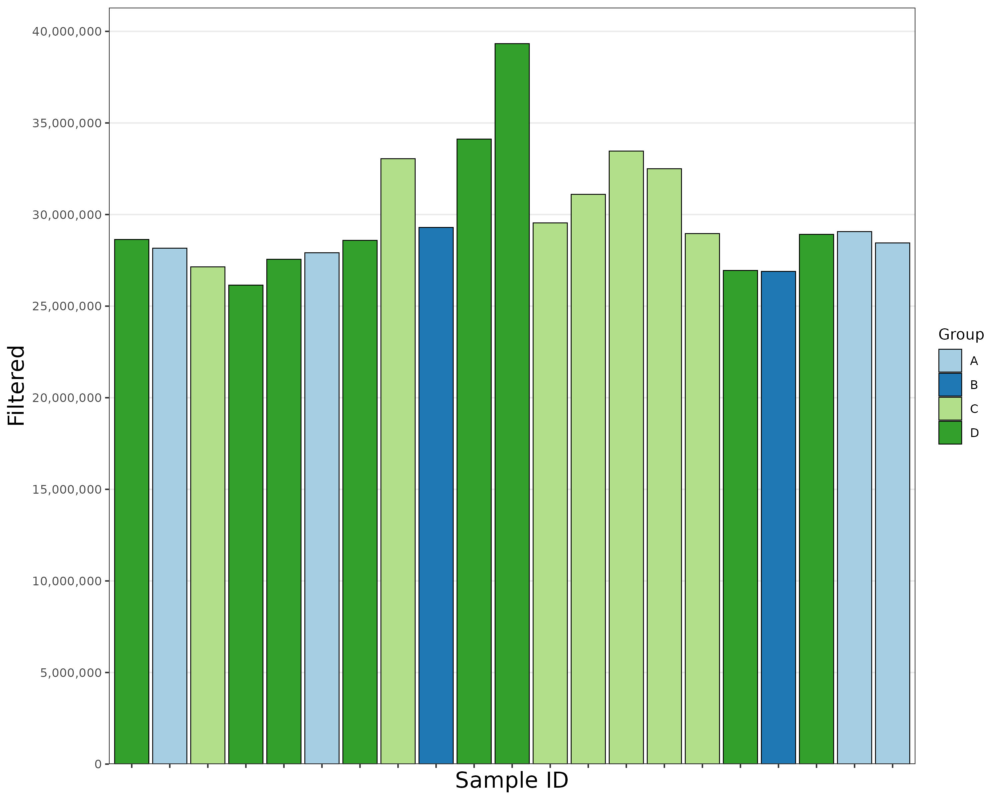

```{r, echo = FALSE, message = FALSE}
library("knitr", quietly = T)
library("tidyr", quietly = T)
library("dplyr", quietly = T)
library("openxlsx", quietly = T)
library("tximport", quietly = T)
library("ensembldb", quietly = T)
library("GenomicFeatures", quietly = T)
library("RColorBrewer", quietly = T)
library("gplots", quietly = T)
library("ggplot2", quietly = T)
library("ggrepel", quietly = T)
library("tsne", quietly = T)
library("umap", quietly = T)
library("MatrixGenerics", quietly = T)
library("DESeq2", quietly = T)
library("BatchJobs", quietly = T)
library("BiocParallel", quietly = T)
library("biomaRt", quietly = T)
library("pheatmap", quietly = T)
library("randomcoloR", quietly = T)
library("plotly", quietly = T)
library("svglite", quietly = T)
library("VennDiagram", quietly = T)
library("DRnaSeq", quietly = T)
library("pheatmap", quietly = T)
library("ggsignif", quietly = T)
library("gridExtra", quietly = T)
library("cowplot", quietly = T)
library("gtable", quietly = T)
library("beeswarm", quietly = T)
library("ggbeeswarm", quietly = T)
library("scales", quietly = T)
library("clusterProfiler", quietly = T)
library("org.Hs.eg.db", quietly = T)
library("AnnotationDbi", quietly = T)
library("DOSE", quietly = T)
```

```{r, echo = FALSE, message=FALSE}
require(knitr)
knitr::opts_chunk$set(echo = TRUE)
knitr::opts_knit$set(root.dir = "./")
sample_data <- "samples_data_new.xlsx"
counts_dir <- "./Counts"
```

This guide provides an overview of what a Differential Expression Analysis report created by the BigMind team contains. For the integrated and automated analysis, we utilized functions from our custom R package, [OmicsKit](https://github.com/BigMindLab/OmicsKit).

## **Preprocessing: Counts per Sample**
### Visualizing Samples Data
Sample metadata is crucial for connecting bioinformatics results to biological significance. The first step in our analysis is to clean the data and prepare it for downstream library requirements.
```{r, echo = FALSE}
sampledata <- data.frame(read.xlsx(sample_data))
sampledata$group <- factor(sampledata$group, ordered = T, levels = c("A/Tc-", "A/Tc+", "B/Tc-", "B/Tc+"))
sampledata$chagas <- factor(sampledata$chagas)
sampledata$gp <- factor(sampledata$gp)
sampledata$cardiac <- factor(sampledata$cardiac)
sampledata$sex <- factor(sampledata$sex)
sampledata$age_cat <- factor(sampledata$age_cat)
rownames(sampledata) <- sampledata$id
sampledata$num <- 1:21

sampledata_disp <- sampledata
sampledata_disp$id <- 1:21
row.names(sampledata_disp) <- NULL
sampledata_disp <- sampledata_disp[, c(1:4, 6:8)]
colnames(sampledata_disp) <- c("ID", "Test", "Condition", "Group", "Sex", "Age", "RIN")
sampledata_disp$Group <- ifelse(sampledata_disp$Group == "An", "A",
                                ifelse(sampledata_disp$Group == "Bn", "B",
                                       ifelse(sampledata_disp$Group == "Ap", "C", "D")))
sampledata_disp$Condition <- ifelse(sampledata_disp$Condition == "A", "Normal", "Disease")
sampledata_disp$Test <- ifelse(sampledata_disp$Test == "N", "Undetected", "Detected")
```

```{r, echo = FALSE}
knitr::kable(sampledata_disp)
```

### Managing Count Files
Identifying samples with abnormal counts can highlight outliers that may need to be excluded from analysis to avoid skewed results.
```{r, echo = FALSE}
count_files <- file.path(counts_dir, paste0(sampledata$id, "_quant.sf"))
names(count_files) <- sampledata$id

txi <- tximport(count_files, type="salmon", txOut=TRUE, countsFromAbundance="no")
counts.tx <- txi$counts
counts.tx <- counts.tx[rowSums(counts.tx) > 0,]

sampledata$tx_counts <- colSums(counts.tx)

# Output
#write.xlsx(sampledata, file = "samples_with_counts.xlsx", colNames = T, rowNames = F, append = F)
```

```{r, eval = FALSE, echo = FALSE}
my_colors <- c("paleturquoise1", "khaki1", "thistle", "lightpink")

p.counts <- ggplot(data = sampledata, aes(x = id, y = tx_counts, fill = group)) +
  theme_bw() + theme(panel.grid.major.x = element_blank(), panel.grid.minor.y = element_blank()) +
  geom_bar(stat="identity", color="black", linewidth = 0.3) + scale_fill_manual(values = my_colors) +
  theme(axis.text.x = element_text(angle = 90, vjust = 0.5, hjust=1)) +
  scale_y_continuous(expand = expansion(mult = c(0, .01)), labels = scales::comma, breaks = seq(0,7e+7,by=0.5e+7)) +
  xlab("Sample ID") + ylab("Counts") + theme(axis.title=element_text(size=16))

p.counts

ggsave("Counts-Transcript_per_Sample.jpg", p.counts, width = 10, height = 8, dpi = 300)
```

```{r, echo = FALSE}
tx2gene <- data.frame(read.xlsx("tx2gene_GRCh38v103.xlsx"))
# tx2gene <- data.frame(read.csv("tx2gene.csv", header = TRUE))

txi.toGene <- summarizeToGene(txi, tx2gene[,c("transcriptID","geneID")])

# Add gene counts
counts.gene <- as.data.frame(txi.toGene$counts)
counts.gene <- counts.gene[rowSums(counts.gene) > 0,]
sampledata$gene_counts <- colSums(counts.gene)

#write.xlsx(sampledata, file = "Samples_with_Counts.xlsx", colNames = T, rowNames = F, append = F, overwrite = T)

# Load geneID annotations
annotations <- c("symbol", "biotype", "chromosome", "gene_start", "gene_end", "gene_length", "description")
geneID.details <- tx2gene[,c("geneID", annotations)]
geneID.details <- geneID.details[!duplicated(geneID.details), ]
```

```{r, echo=FALSE, include=FALSE}
################################################################################################################
## Extra genes
### Remove NAs
for (i in 1:nrow(geneID.details)) {
  if (is.na(geneID.details$symbol[i])) {
    geneID.details$symbol[i] <- geneID.details$geneID[i]
  }
}

### Special names
ensg_vector <- c("ENSG00000215304", "ENSG00000261575", "ENSG00000267053", "ENSG00000267618", "ENSG00000285794",
                 "ENSG00000249679", "ENSG00000268189", "ENSG00000285839", "ENSG00000261915", "ENSG00000229337",
                 "ENSG00000273711")
new_genename <- c("Lnc-GOLGA8K-1", "C17orf58P", "Lnc-ZNF146-1", "RAD51L3-RFFL", "SCAND1P",
                  "CCDC110-As", "Lnc-CYP4F22-3", "KTI12-H", "NHR-DC", "Lnc-NFE2L2-1",
                  "PTGR2-As")

for (i in 1:length(ensg_vector)) {
  geneID.details$symbol[geneID.details$geneID == ensg_vector[i]] <- new_genename[i]
  
  print(geneID.details$symbol[geneID.details$geneID == ensg_vector[i]])
}

### Checking
sum(is.na(geneID.details$symbol))
geneID.details$symbol[geneID.details$geneID == "ENSG00000268189"]
################################
```

```{r, echo = FALSE}
# Add annotations
counts.gene_annotations <- counts.gene
counts.gene_annotations$geneID <- rownames(counts.gene_annotations)
counts.gene_annotations <- add_annotations(counts.gene_annotations, geneID.details, variables = annotations)

#write.xlsx(counts.gene_annotations, file = "Raw_Gene_Counts_Annotated.xlsx", colNames = T, rowNames = F, append = F, overwrite = T)
#write.csv(counts.gene_annotations, file = "Raw_Gene_Counts_Annotated.csv", col.names = T, row.names = F)
```

```{r, echo = FALSE}
blacklist_nRibo <- data.frame(read.csv("blacklist_nuclear-ribo.tsv", sep = "\t", header = TRUE))
blacklist_mtRibo <- data.frame(read.csv("blacklist_mito-ribo.tsv", sep = "\t", header = TRUE))
blacklist_allRibo <- data.frame(read.csv("blacklist_all-ribo.tsv", sep = "\t", header = TRUE))

# Keep the genes in each blacklist
genecounts.nRibo <- counts.gene[rownames(counts.gene) %in% blacklist_nRibo[,1], ]
genecounts.mtRibo <- counts.gene[rownames(counts.gene) %in% blacklist_mtRibo[,1], ]
genecounts.filtered <- counts.gene[!(rownames(counts.gene) %in% blacklist_allRibo[,1]), ]

sampledata$nRibo <- colSums(genecounts.nRibo)
sampledata$mtRibo <- colSums(genecounts.mtRibo)
sampledata$filtered <- colSums(genecounts.filtered)

#write.xlsx(sampledata, file = "samples_with_counts.xlsx", colNames = T, rowNames = F, append = F)

# Filter the txi object
keep <- !(rownames(txi.toGene$counts) %in% blacklist_allRibo[,1])

txi.toGene$abundance <- txi.toGene$abundance[keep, ]
txi.toGene$counts <- txi.toGene$counts[keep, ]
txi.toGene$length <- txi.toGene$length[keep, ]
```

```{r, echo  = FALSE}
nice_colors <- brewer.pal(12,"Paired")

#for (bl in c("nRibo", "mtRibo")) {
#  p.sub <- ggplot(data = sampledata, aes_string(x = "id", y = bl, fill = "group")) +
#    theme_bw() + theme(panel.grid.major.x = element_blank(), panel.grid.minor.y = element_blank()) +
#    geom_bar(stat="identity", color="black", linewidth = 0.3) + scale_fill_manual(values = nice_colors) +
#    theme(axis.text.x = element_text(angle = 90, vjust = 0.5, hjust=1)) +
#    scale_y_continuous(expand = expansion(mult = c(0, .01)), labels = scales::comma) +
#    xlab("Sample ID") + ylab(bl) + theme(axis.title=element_text(size=16))
#  
#  print(p.sub)
#  
#  ggsave(paste0("Counts-Transcript_per_Sample_", bl, ".jpg"),
#         p.sub, width = 10, height = 8, dpi = 300)
#}

# Filtered
p.filt <- ggplot(data = sampledata, aes(x = id, y = filtered, fill = group)) +
  theme_bw() + theme(panel.grid.major.x = element_blank(), panel.grid.minor.y = element_blank()) +
  geom_bar(stat="identity", color="black", linewidth = 0.3) +
  scale_fill_manual(name = "Group", values = nice_colors,
                    breaks = c("A/Tc-", "B/Tc-", "A/Tc+", "B/Tc+"),
                    labels = c("A", "B", "C", "D")) +
  theme(axis.text.x = element_blank()) +
  scale_y_continuous(expand = expansion(mult = c(0, .05)), labels = scales::comma, breaks = seq(0,7e+7,by=0.5e+7)) +
  xlab("Sample ID") + ylab("Filtered") + theme(axis.title=element_text(size=16))


ggsave("plots/Counts-Transcript_per_Sample_filtered.jpg", p.filt,
       width = 10, height = 8, dpi = 300)
```

```{r plot 1, echo = FALSE}

```


